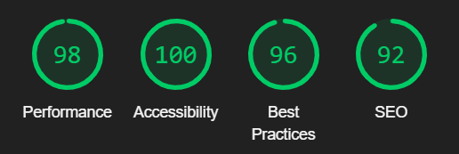
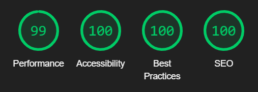

# Title of Game displayed here

(screenshot of game on all screen sizes)

## Overview

This is a bla bla 

## Contents 

contents of all sections of Readme file

- [Overview](#overview)
- [Contents](#contents)

- [User Experience](#user-experience)
    - [User Stories](#user-stories)
    - [Target Audience](#target-audience)

- [Design](#design)
    - [Wireframes](#wireframes)
    - [Typography](#typography)
    - [Colour Scheme](#colour-scheme)
    - [Imagery](#imagery)

- [Features](#features)
    - [Home Page](home-page)
    - [Rules Page](#rules-page)
    - [Game Page](#game-page)
    - [Show Score Section](#show-score-section)
    - [Future Features](#future-features)

- [Technologies Used](#technologies-used)
    - [Languages Used](#languages-used)
    - [Frameworks, Libraries & Programs Used](#frameworks-libraries--programs-used)

- [Testing](#testing)
    - [Validation](#validation)
        - [W3C Markup Validator](#w3c-markup-validator)
        - [W3C CSS Validator](#w3c-css-validator)
        - [JSHInt Validator](#jshint-validator)
    - [Lighthouse Testing](#lighthouse-testing)
        - [Home Page Result](#home-page-result)
        - [Rules Page Result](#rules-page-result)
        - [Game Page Result](#game-page-result)
    - [Test Grid](#test-grid)
    - [Fixed Bugs](#fixed-bugs)
    - [Known Bugs](#known-bugs)

- [Deployment](#deployment)
    - [Github Pages](#github-pages)
    - [Forking the Github Repository](#forking-the-github-repository)
    - [Making a Local Clone](making-a-local-clone)

- [Credits](#credits)
    - [Code](#code)
    - [Content](#content)
    - [Media](#media)

- [Acknowledgments](#acknowledgments)

# User Experience
## User stories
1. **As a first time visitor** : The user is curious and wants to complete the quiz to check knowledge on general history facts.

2. **As a returning visitor** : The user takes the quiz with randomized questions, and checks his knowledge, comparing the final results.

## Target Audience

* This site's target audience is wide, ranging from children / teenagers to elderly users, regardless of their cultural or social background.

* History teachers on a secondary level.

* EFL / ESL (English foreign language, English second language) teachers.

* EFL / ESL Students at all levels and age groups.

# Design 
## Wireframes

images of wireframe sketches and plans of functions.

* I did sketches on my iPad notes with the general ideas for the structural layout of the game as well as a few of the functions.

## Typography

description of font

## Colour Scheme

(images of colour scheme and background image)

* the colours were selected to work well with the background image, to create a warm and welcoming feeling to the game and also for the target audience being teachers or children in a classroom setting.

## Imagery 

(background image maybe ?)

* The background image was selected to cater to a wide range of users as per the target audience, children/ teenagers, adult students, teachers/tutors.

# Features 

-   Responsive on all device sizes.

-   Interactive elements - hover styles on links and navigation.

-   Header with navigation is fixed on the top of the screen so users can easily navigate to different parts.

## Home Page 

(screenshot of home page)

* user is presented with a landing page that contains a box with a brief description of the game and two buttons that link to rules.html and game.html.

## Rules Page 

(screenshot of rules page)

* the rules are displayed in an unordered list.

* Rewrite the rules in these points

## Game Page

(screenshot of game page on mobile and laptop screen sizes)

* Both the questions and the answers are shuffled in order with every start of the game.

* The first question is presented with 4 answer options.

* When a user selects their option, it will either turn green if the user selects the correct option, or the incorrect option is selected it will be highlighted red while the correct answer is highlighted green.
(screenshot of example)

* The score tally is below the header that counts the correct and incorrect scores as the user inputs them.
(screenshot of example)

* The 'Next' button will be displayed when the user selects their choice, enabling the user to move to the next question once their answer has been selected.
(screenshot example)

## Show Score Section

(Screenshot of mobile and laptop/tablet sizes)

* After submitting the final question, a user receives a prompt on their browser to enter their name before moving onto the final section of the quiz.

(screenshot of mobile and laptop Prompt)

* The username is then displayed when the score message is displayed.

(screenshot)

* The show score function displays a message to the user with their final score. Depending on the users' score the message will change by using an if else statement.

(screenshot)

* The 'Next' button's inner HTML changes to 'Play Again' and restarts the game as well as resetting the score tally.

## Future features

* A future feature I would include would be increasing the amount of available questions a user can select, while only running a random selection of 20. This way, a user could have a completely different quiz experience with entirely different questions they haven't answered. I wanted to include this on this version but found I didn't have enough time in the end to implement this feature.

* Another future feature I thought of was creating a social element to it, creating a way of multiple users being able to play games against each other or in groups. I thought this would work well as it would in a classroom setting where a teacher could split students into groups. 

# Technologies Used 

## Languages Used

-   [HTML5](https://en.wikipedia.org/wiki/HTML5)
-   [CSS3](https://en.wikipedia.org/wiki/Cascading_Style_Sheets)
-   [JavaScript](https://en.wikipedia.org/wiki/JavaScript)

## Frameworks, Libraries & Programs Used

1. [GitPod:](https://www.gitpod.io/)
    - I used GitPod as my main code editor for this project.

1. [Visual Studio Code](https://code.visualstudio.com/)
    - I used Visual Studio Code as another editor for this project.

1. [Git](https://git-scm.com/)
    - Git was used for version control by utilizing the Gitpod terminal to commit to Git and Push to GitHub.

1. [GitHub:](https://github.com/)
    - GitHub is used to store the projects code after being pushed from Git.

1. [Google Fonts:](https://fonts.google.com/)
    - Google fonts were used to import the 'Montserrat' font into the style.css file which is used on all pages throughout the project.

1. [Font Awesome:](https://fontawesome.com/)
    - Font Awesome was used on all pages throughout the website to add icons to different sections.

1. [Design.com:](https://design.com/)
    - Design.com was used to generate the logo.

1. [Sketchbook:](https://sketchbook.com/)
    - Sketchpad was used to edit the logo.

1. [ColorSpace:](https://mycolor.space/)
    - ColorSpace was used to generate the colour palletes for the site.

1. [Apple Numbers:](https://apple.com/numbers/)
    - I used the Numbers app on my iPad pro to create my test grid spreadsheets.

1. [Notes:](https://apple.com/notes/)
    - I used the apple notes app on both my iPad and my iPhone for sketches, or any other planning/checklists used for this project.

# Testing
## Validation

The W3C Markup Validator and W3C CSS Validator Services were used to validate every page of the project to ensure there were no syntax errors in the project.

### W3C Markup Validator

-   [W3C Markup Validator](https://jigsaw.w3.org/css-validator/#validate_by_input) - I input the source code from each page into the validator and all pages received no errors or warnings.
    (screenshot of result)

### W3C CSS Validator
    
-   [W3C CSS Validator](https://jigsaw.w3.org/css-validator/#validate_by_input)
    screenshot of result

### JSHint Validator

- [JSHint Validator](https://jshint.com/)
    (screenshot of result)
    

## Lighthouse Testing
### Home Page Result

### Rules Page Result

(screenshot of result)

### Game Page Result

## Further Testing

### Test Grid 

(screenshot)

I created a testing grid on Apple Numbers which I used throughout the process of building this site. The grids have categories for each link/button to ensure all of them work correctly and redirect to a new tab if needed. There is also a grid to test responsive design for each section of the page, the different sections are outlined below.

* The Website was tested on Google Chrome, Internet Explorer, Microsoft Edge and Safari browsers.

* The website was viewed and tested on a variety of devices such as Desktop, Laptop, iPhone 10, iPhone 12, iPhone 14 Pro and iPad Pro.

* A large amount of testing was done to ensure that all pages were linking correctly, as well as buttons and form submition and inputs.

* I also did a good amount of testing the responsiveness of the website on different phone screens vertical and horizontal view, to make sure all the images and text are the correct size and position.

* Friends and family members were asked to review the site and documentation to point out any bugs or user experience issues.

* Tested on all devices available on chrome developer tools.

## Fixed Bugs

* I fixed a few different bugs throughout the process of building this game, mostly just syntax errors, but I discovered how a typo error can be detrimental in JavaScript in accidentally creating an infinite loop and crashing the site on multiple occasions! I identified a typo in the shuffleAnswers function where I put 1 > 0 instead of i > 0 and once I fixed it I was able to call the function in the code to shuffle the answers displayed without any issues. 

* describe another bug i fixed?

## Known Bugs

* I don't THINK there are any bugs in this final project, but I did find the debugging process to be difficult at times so there might be bugs I am unaware of. I found using the JSHint validator to be very helpful in assisting me during the process of building this, as it breaks down all the errors and makes it easy to fix issues.

# Deployment

## GitHub Pages

The project was deployed to GitHub Pages using the following steps:

1. Log in to GitHub and locate the [GitHub Repository](https://github.com/)
2. At the top of the Repository, locate the "Settings" Button on the menu.
3. Scroll down the Settings page until you locate the "GitHub Pages" Section.
4. Under "Source", click the dropdown called "None" and select "Master Branch".
5. The page will automatically refresh.
6. Scroll back down through the page to locate the now published site in the "GitHub Pages" section.

## Forking the GitHub Repository

By forking the GitHub Repository we make a copy of the original repository on our GitHub account to view and/or make changes without affecting the original repository by using the following steps...

1. Log in to GitHub and locate the [GitHub Repository](https://github.com/)
2. At the top of the Repository (not top of page) just above the "Settings" Button on the menu, locate the "Fork" Button.
3. You should now have a copy of the original repository in your GitHub account.

## Making a Local Clone

1. Log in to GitHub and locate the [GitHub Repository](https://github.com/)
2. Under the repository name, click "Clone or download".
3. To clone the repository using HTTPS, under "Clone with HTTPS", copy the link.
4. Open Git Bash
5. Change the current working directory to the location where you want the cloned directory to be made.
6. Type `git clone`, and then paste the URL you copied in Step 3.

# Credits 

## Code

* I took inspiration for structuring the game from this video in on this youtube channel (create a link to the video and channel).
* I have highlighted code taken from this tutorial in comments in the Javascript and CSS documents.

## Content

* I used the questions from this website ( link to the website )

## Media 

* The background image was taken from unsplash and I have linked the image with all the info about the creator/publisher of the image.

# Acknowledgments 

I would like to express my gratitute to my mentor for continuous helpful feedback, advice and resources. Tutor support at Code Institute for their support, as well as the Slack Community, and my class group for always replying to my messages within minutes of being sent! I would also like to thank Code Institute for all the course material I've read and re-read during this process.

